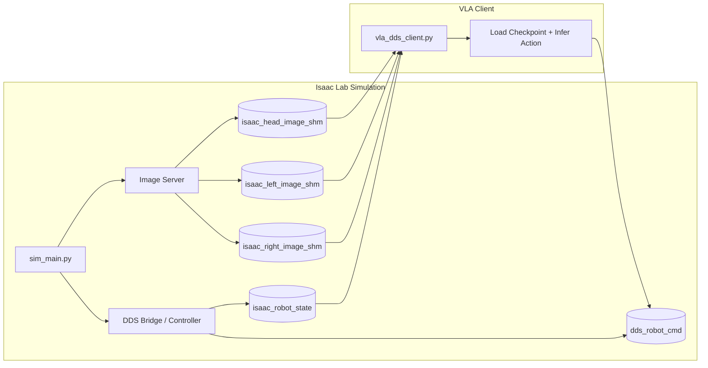

# Unitree VLA Stack

**Orchestrierungs-Repo für UnifoLM-VLA Inferenz mit Unitree Isaac Lab/Sim**  
Von **Fabian Fichtl** – Research Engineer, Mechatronics & Robotics

> ⚠️ **Hinweis:** Dieses Repo enthält **nur Dokumentation und Orchestrierung**. Der eigentliche Code liegt in separaten Repos (siehe unten).

---

## 📦 Verwendete Repositories

| Repo | Rolle | GitHub-Link |
|------|-------|-------------|
| `unitree_sim_isaaclab` | Isaac Lab Simulation, Image Server, DDS Bridge | [Fichtl00/unitree_sim_isaaclab](https://github.com/Fichtl00/unitree_sim_isaaclab) |
| `unifolm-vla-inference-dds-shm-adapter` | VLA Inference Code, DDS Client | [Fichtl00/unifolm-vla-inference-dds-shm-adapter](https://github.com/Fichtl00/unifolm-vla-inference-dds-shm-adapter/tree/feature/dds_adapter/vla_isaac_sim_bridge) |
| `xr_teleoperate/teleop/teleimager` | Image Server für Kamera-Frames → SHM | [unitreerobotics/xr_teleoperate](https://github.com/unitreerobotics/xr_teleoperate) |
| `unitree_sdk2_python` | DDS/SDK Utilities (`unitree_sdk2py`) | [unitreerobotics/unitree_sdk2](https://github.com/unitreerobotics/unitree_sdk2) |

### Externe/Optionale Dependencies

- **UnifoLM-VLA-*** Checkpoints (Model Weights) – lokal: `/home/omniverse-2/UnifoLM-VLA-*`
- **LIBERO** – alternative Sim Tasks
- **unitree_deploy** – Real-Robot Deployment Client

---

## 🧩 Architektur-Überblick

### Komponenten & Verantwortlichkeiten



| Komponente | Verantwortlichkeit |
|------------|-------------------|
| **Simulator** (`unitree_sim_isaaclab`) | Startet Image Server & DDS Bridge; schreibt Kamera-Bilder in SHMs (`isaac_*_image_shm`), Roboter-State in `isaac_robot_state`; liest `dds_robot_cmd` für Motor-Befehle; hört auf DDS `rt/reset_pose/cmd` |
| **Image Server** (`teleimager`) | Erfasst/rendert Kamera-Frames und schreibt sie in benannte SHMs, die der Client liest |
| **VLA Client** (`vla_dds_client.py`) | Liest Bilder + `isaac_robot_state` via `dds.sharedmemorymanager` / `tools.shared_memory_utils`, führt UnifoLM-VLA Modell aus, schreibt Action-Dict in `dds_robot_cmd` SHM |
| **Reset Publisher** (`reset_pose_test.py`) | Veröffentlicht Reset-Kategorien auf DDS `rt/reset_pose/cmd` – typischerweise im Sim-Container ausgeführt (`unitree_sdk2py` verfügbar) |

### Datenfluss

1. **Simulation** erstellt SHMs (`isaac_head_image_shm`, `isaac_left_image_shm`, `isaac_right_image_shm`, `isaac_robot_state`)
2. **VLA Client** hängt sich an SHMs an, liest Bilder + State
3. **VLA Inferenz** berechnet Action
4. **Action** wird in `dds_robot_cmd` SHM geschrieben
5. **Simulation** liest Action aus und wendet sie an

---

## 🚀 Quickstart – Isaac Lab Bridge (Dex1 / Stack Cube)

### Start-Reihenfolge (wichtig!)

1. **Simulation zuerst** starten → erstellt SHMs
2. **VLA Client zweitens** starten → hängt sich an SHMs an

---

### 🧪 Step A – Debug / SHM-Transfer verifizieren

#### 1. Simulation starten (im Docker-Container)

```bash
# Docker starten & bash betreten
sudo docker run -it --rm \
  --gpus all \
  -v /home/omniverse-2/.config/xr_teleoperate:/root/.config/xr_teleoperate \
  -v /home/omniverse-2/unitree_sim_isaaclab:/home/code/unitree_sim_isaaclab \
  -v /home/omniverse-2/xr_teleoperate/teleop/teleimager:/home/code/unitree_sim_isaaclab/teleimager \
  -v /home/omniverse-2/Documents:/home/omniverse-2/Documents \
  --network host \
  --ipc=host \
  --shm-size=8g \
  --name unitree-sim \
  unitree-sim:latest \
  bash -c "cd /home/code/unitree_sim_isaaclab && ./fetch_assets.sh && bash"

# Im Container
conda activate unitree_sim_env
cd /home/code/unitree_sim_isaaclab
python sim_main.py \
  --device cpu \
  --enable_cameras \
  --camera_write_interval 1 \
  --task Isaac-Stack-RgyBlock-G129-Dex1-Joint \
  --enable_dex1_dds \
  --robot_type g129 \
  --no_render
```

#### 2. VLA Client mit Image-Presence Logging starten

```bash
conda activate unifolm-vla
cd /home/omniverse-2/unifolm-vla/unifolm-vla

python deployment/isaaclab_bridge/vla_dds_client.py \
  --ckpt_path /home/omniverse-2/UnifoLM-VLA-Base/checkpoints/pytorch_model.pt \
  --vlm_pretrained_path unitreerobotics/UnifoLM-VLM-Base \
  --instruction "grab the red cube with the left arm" \
  --device cuda \
  --camera_color_space bgr \
  --image_order head left right \
  --log_image_presence \
  --log_image_presence_interval 10
```

#### Debugging-Checks

- Sim muss ausgeben: `========= create image server =========` + `create image server success`
- Auf Host prüfen: `ls -l /dev/shm | egrep 'isaac_head_image_shm|isaac_left_image_shm|isaac_right_image_shm|isaac_robot_state'`
- Client-Logs: `Image inputs | available=... | missing=...` + `Received first valid sim data` / `Published command`

---

### 🤖 Step B – Inference & Live Reset

#### 1. Simulation starten (ohne Debug-Flag)

```bash
conda activate unitree_sim_env
cd /home/code/unitree_sim_isaaclab
python sim_main.py \
  --device cpu \
  --enable_cameras \
  --task Isaac-Stack-RgyBlock-G129-Dex1-Joint \
  --enable_dex1_dds \
  --robot_type g129 \
  --no_render
```

#### 2. VLA Client (Inference Mode)

```bash
conda activate unifolm-vla
cd /home/omniverse-2/unifolm-vla/unifolm-vla

python deployment/isaaclab_bridge/vla_dds_client.py \
  --ckpt_path /home/omniverse-2/UnifoLM-VLA-Base/checkpoints/pytorch_model.pt \
  --vlm_pretrained_path unitreerobotics/UnifoLM-VLM-Base \
  --instruction "grab the red cube with the left arm" \
  --device cuda \
  --camera_color_space bgr \
  --image_order head left right
```

#### 3. Live Scene Reset (im Sim-Container)

**Reset-Kategorien:**

| Category | Effekt |
|----------|--------|
| `1` | Reset object |
| `2` | Reset all |
| `3` | Reset assembly (default) |

---

**Interaktiv (empfohlen für Debugging):**

```bash
sudo docker exec -it unitree-sim bash
cd /home/code/unitree_sim_isaaclab
source /opt/conda/etc/profile.d/conda.sh
conda activate unitree_sim_env

# Beispiel: Reset object
python reset_pose_test.py --category 1
```

---

**Non-Interaktiv (einzeilig, robust):**

```bash
# Category 1 – Reset object
sudo docker exec -it unitree-sim bash -lc "conda run -n unitree_sim_env --no-capture-output python /home/code/unitree_sim_isaaclab/reset_pose_test.py --category 1"

# Category 2 – Reset all
sudo docker exec -it unitree-sim bash -lc "conda run -n unitree_sim_env --no-capture-output python /home/code/unitree_sim_isaaclab/reset_pose_test.py --category 2"

# Category 3 – Reset assembly
sudo docker exec -it unitree-sim bash -lc "conda run -n unitree_sim_env --no-capture-output python /home/code/unitree_sim_isaaclab/reset_pose_test.py --category 3"
```

---

## 🔧 Troubleshooting

### Häufige Fehler & Fixes

| Problem | Lösung |
|---------|--------|
| `ModuleNotFoundError: unitree_sdk2py` | `reset_pose_test.py` im Sim-Container ausführen oder `unitree_sdk2py` im Host-Env installieren |
| `Permission denied` auf SHMs (resource_tracker warnings) | `sudo chmod 666 /dev/shm/isaac_*` oder Sim mit gleicher UID wie Host-User starten |
| Checkpoint action-dim Mismatch | Kompatiblen Checkpoint wählen (z. B. `UnifoLM-VLA-Libero`) oder `action_dim` in Model-Config anpassen |
| Keine Bilder | `--camera_write_interval 1` setzen; Kamera-Namen im Task mit `head/left/right` übereinstimmen lassen |
| `python: can't open file '/home/code/reset_pose_test.py'` | Absoluten Pfad verwenden oder `cd` in `/home/code/unitree_sim_isaaclab` |
| `conda` nicht im Container gefunden | `/opt/conda/etc/profile.d/conda.sh` sourcen oder `conda run` verwenden |

### SHM-Verifizierung

```bash
ls -l /dev/shm | egrep 'isaac|isaac_head|isaac_left|isaac_right' || true
```

### SHM-Permissions-Fix (Host)

```bash
sudo chmod 666 /dev/shm/isaac_head_image_shm /dev/shm/isaac_left_image_shm /dev/shm/isaac_right_image_shm /dev/shm/isaac_robot_state
```

---

## 📂 Lokale Pfad-Struktur

| Komponente | Pfad |
|------------|------|
| Simulation | `/home/omniverse-2/unitree_sim_isaaclab` |
| VLA Client | `/home/omniverse-2/unifolm-vla/unifolm-vla` |
| Teleimager | `/home/omniverse-2/xr_teleoperate/teleop/teleimager` |
| Checkpoints | `/home/omniverse-2/UnifoLM-VLA-*` |

---

## 📝 Wichtige Hinweise

- **Start-Reihenfolge:** Simulation → VLA Client (niemals umgekehrt!)
- **Docker:** `--ipc=host` oder `/dev/shm` mounten, damit SHMs zwischen Host und Container sichtbar sind
- **SHMs:** Werden bei Neustart des Clients/Bridge entfernt → bei veralteten SHMs Sim neu starten
- **Große Dateien:** Checkpoints (`.pt`) nicht versionieren → Git LFS oder externer Artifact Store nutzen
- **xr_teleoperate:** Nur `teleimager` wird benötigt (Image Server); VR-Teleoperation optional

---

## 📚 Referenzen

- Client Implementation: `deployment/isaaclab_bridge/vla_dds_client.py`
- Reset Publishing Examples: `unitree_sim_isaaclab/reset_pose_dds.py`, `unitree_sim_isaaclab/reset_pose_test.py`
- Isaac Lab Docker Docs: https://isaac-sim.github.io/IsaacLab/main/source/deployment/docker.html
- CloudXR Teleoperation: https://isaac-sim.github.io/IsaacLab/main/source/how-to/cloudxr_teleoperation.html
